<!-- ────────────────────────────────────────────────────────── -->

### `> ls ./projects`

| repo | описание | стек |
|---|---|---|
| [**MOCChecker**](https://github.com/Palash-hub/MOCChecker) | проверяет ссылки в Obsidian-хранилище | `C#` |
| **nfad** *(поправь ссылку)* | детектор сетевых аномалий по NetFlow/IPFIX | `Python` `XGBoost` `CIC-IDS2017` |
| **MiniBank** *(поправь ссылку)* | учебный банковский движок | `C#` `Clean Architecture` |

### `> cat contacts.txt`

<!-- замени username / адрес на свои -->

<!-- ────────────────────────────────────────────────────────── -->

### `> stats --uplink`

  
  

